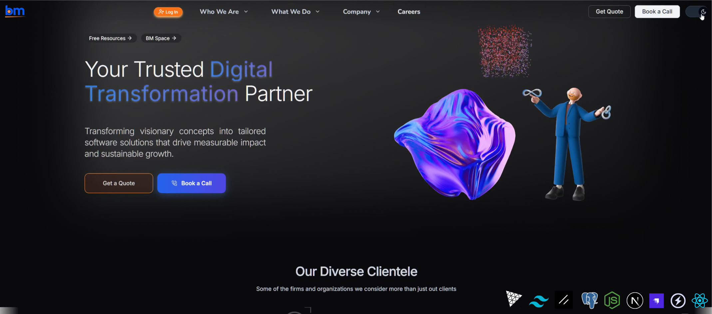

# Bitmutex-Website - Batteries Included Business Starter Template : Strapi5 + Next15 + Postgres + SocketIO

**Bitmutex-Website** - A `modern`, `cloud-native` `ready-to-use` business website `starter template` with all the batteries included from SEO to Reusable Blocks. Built using `Strapi 5` at Backend and `NextJs 15 SSR` with `React 19` in Frontend as a BFF (Backend For Frontend).

[](https://uptime.betterstack.com/?utm_source=status_badge)
[](https://github.com/aamitn/bitmutex-website/actions/workflows/deploy.yml)
[](https://sonarcloud.io/summary/new_code?id=aamitn_bitmutex-website)
[](https://sonarcloud.io/summary/new_code?id=aamitn_bitmutex-website)
[](https://sonarcloud.io/summary/new_code?id=aamitn_bitmutex-website)
[](https://sonarcloud.io/summary/new_code?id=aamitn_bitmutex-website)
[](https://sonarcloud.io/summary/new_code?id=aamitn_bitmutex-website)


| Screenshot | Illustration |
|------------|--------------|
|  |  |


## 🚀 Features
-  **Strapi 5 CMS** (Headless API-driven backend)
-  **Next.js 15** (Fast, SSR-capable frontend)
-  **PostgreSQL 15** (Database for Strapi)
-  **Docker-Compose Support** (For seamless development & deployment)
-  **Native Built-In Live Chat to Discord** (Powered by Socket.io integrated within strapi, No 3rd Party Service/Embed/Widgets)
-  **Strapi Auto-Admin User Creation** (Creates admin user on first run)
-  **Health Check & Auto-Restart** (Ensures services stay healthy)
-  **Sitewide Dynamic SEO** (with Strapi SEO Plugin Integration)
-  **Multiple Custom Collections, Reusable Blocks and Single Types**
-  **Real-Time Features** (Provides live website visitor count)


## 📂 Project Structure
```
📦 bitmutex-website
├── 📂 client # Next.js frontend
		├── Dockerfile
├── 📂 server # Strapi backend (Backend CMS)
		├── Dockerfile
├── 📜 copy-env.mts # Used by root level project package.json for auto copying of .env.example to .env in both `client` and `server` folders
├── 📜 docker-compose.yml # Container configuration
├── 📜 seed-data.tar.gz # Database seed (must be imported manually for data reproducability)
├── 📜 ecosystem.config.cjs (Used for production deployments with PM2)
├── 📜 package.json (root level dependencies to initialize setup of client and server apps)
├── 📜 package.lock.json (npm lockfile)
├── 📜 yarn.lock(yarn lockfile, YARN is preferred for this project )
└── 📜 README.md # This file
```

## Available Commands

| Location        | Command              | Description |
|-----------------|----------------------|-------------|
| **Project Root** | `pnpm client`        | Run the **client** development server from the project root. |
|                 | `pnpm server`        | Run the **server** development server from the project root. |
|                 | `pnpm setup:client`  | Install dependencies for the client and copy `.env` file. |
|                 | `pnpm setup:server`  | Install dependencies for the server and copy `.env` file. |
|                 | `pnpm spawn`         | Install dependencies for root, client, and server in one go. |
|                 | `pnpm dev`           | Start **Strapi** (server) and **Next.js** (client) in parallel for development. |
|                 | `pnpm build`         | Build both server and client in parallel, start server, and exit on build result. |
|                 | `pnpm start`         | Start server and client in parallel (production mode). |
|                 | `pnpm seed`          | Import seed data into Strapi from `seed-data.tar.gz`. |
|                 | `pnpm export`        | Export Strapi data without encryption to `seed-data`. |
|                 | `pnpm repo:upstream` | Fetch and merge latest changes from `upstream/main`. |
|                 | `pnpm repo:sync`     | Pull the latest changes from `origin/main`. |
|                 | `pnpm backup`        | Uploads Strapi export `seed-data.tar.gz` to Cloudflare R2 Storage |
| **Backend Server**      | `pnpm develop`       | Start Strapi in development mode. |
|                 | `pnpm start`         | Start Strapi in production mode. |
|                 | `pnpm build`         | Build Strapi project. |
|                 | `pnpm strapi`        | Run Strapi CLI commands. |
|                 | `pnpm deploy`        | Deploy the Strapi project. |
| **Frontend Client**      | `pnpm dev`           | Start Next.js in development mode using Turbopack. |
|                 | `pnpm build`         | Build the Next.js application for production. |
|                 | `pnpm start`         | Start Next.js in production mode. |
|                 | `pnpm lint`          | Run ESLint to check for code quality issues. |

  
## ⚙️Setup Instructions
  

### 1️⃣ **Clone the Repository**
```sh
git clone --depth=1 https://github.com/aamitn/bitmutex-website.git
cd  bitmutex-website
```
##### omit the `--depth=1` if you want to download the repo with lifetime git history , genrally required for devs contributing to this project


### 2️⃣ **Install Dependencies and Setup Env File**

```sh
pnpm spawn
```
This will run pnpm install  and also copies .env.example to .env on both `client` and `server` directories. After this step `setup your .env` vars accordingly on the auto-generated file.  Create your databases as required. Schema will be auto-generated by Strapi.
- Set `DATABASE_CLIENT=postgres/mysql/sqlite`
- Go to `/server/config/database.ts` and provide DB Credentials there


### 3️⃣ **Run Strapi and Next initially to create strapi DB schemas**
  ```
 pnpm dev
  ```
- After running this strapi should start, go to `http://localhost:1337` and create admin user
- Ctrl-C to stop both strapi and next


### 4️⃣ **Import/Seed DB**
You may run this on the project root,
  ```
 pnpm seed
  ```
  or you may run this in `server` directory by doing `cd server`
  ```sh
 pnpm strapi import -f ../seed-data.tar.gz --force
  ```
 After running this strapi should strart, go to `http://localhost:1337` and create admin user


### 5️⃣  **Finally Start the application for development**
  ```sh
pnpm dev
  ```
  This will start both strapi and nextjs  in development mode (next will have `live refresh` and `watch` enabled)
 
### 6️⃣  **Build for Production**
- Change your .env vars accordingly for production use case
- Go to project root and run `pnpm build`
- Ensure build is successful adn run `pnpm start`
> To run in cloud VPS/Hosting, use `pm2` , just close any other running instances
  -- Navigate to project root and run `pm2 start ecosystem.config.cjs`
  -- Run `pm2 list` to check status and go to [`http://localhost:1337] and [http://localhost:3001]`
  -- If all started successfully, then autostart the app on machine restart using `pm2 save` and `pm2 startup`
  commands.
> Use `/server/src/admin/vite.config.ts` to control admin dashboard domain access

### 7️⃣  **Upgrade Strapi to Latest Version**
  ```sh
  npx @strapi/upgrade latest 
  OR
  pnpx @strapi/upgrade latest 
  ```
  This will upgrade  strapi to its latest version. More info [here](https://docs.strapi.io/cms/upgrade-tool)

### 8️⃣ **Export DB**
You may run this on the project root,
  ```
 pnpm export
  ```
  or you may run this in `server` directory by doing `cd server`
  ```sh
  pnpm strapi export --no-encrypt -f ../seed-data
  ```
 After running this a file named `seed-data.tar.gz` will be created at project root


## ☁️ Cloud Native Setup Instructions

```sh
docker-compose  up  --build
```

This will start:
- PostgreSQL at `localhost:5432`
- Strapi CMS at `http://localhost:1337`
- Next.js Frontend at `http://localhost:3000`

  

## 📥 **Manual Data Import (Strapi Limitation)**
  
⚠️ **Strapi does NOT support data import in Docker builds** ([GitHub Issue-17809](https://github.com/strapi/strapi/issues/17809))

**To manually import seed data try:**

  ```sh
  docker  exec  -it  bitmutex-strapi  bash
  yarn  strapi  import  -f  /seed-data.tar.gz  --force
  ```


## 🔑 Default Admin Credentials
> These credentials are created automatically when `AUTO_CREATE_ADMIN=true` in `docker-compose.yml` or `.env` inside `server` directory.

-  **Email**: `admin@bitmutex.com`
-  **Password**: `strapiadmin`   
🚨 **Change the default password after the first login!**

  

## 📞 Support
If you encounter issues, feel free to [ open an issue](https://github.com/aamitn/bitmutex-website/issues/new/choose).
Designed, Developed and Maintained by `Bitmutex Technologies`
